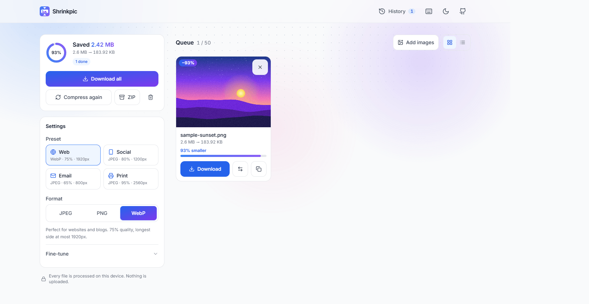

<div align="center">
  

# Shrinkpic

  **Compress images in your browser. Nothing ever leaves your device.**

  JPG, PNG, WebP, AVIF, GIF and BMP files are resized and re-encoded by your own
  browser — no uploads, no accounts, no tracking. Turn off your Wi-Fi and it
  still works.

  <a href="https://shrinkpic.adenaufal.com"></a>
  
</div>

---

## Why this one

Every mainstream online compressor — TinyPNG, Compressor.io, and the rest —
works by uploading your files to a server. Shrinkpic cannot, because there
is no server: the whole pipeline is `<canvas>` and Web Workers running in your
tab.

That is verifiable, not a marketing line. Open your browser's developer tools,
switch to the Network tab, and compress a batch: there are zero requests. Or
install the app and go offline — it behaves identically.

## Features

- **100% on-device compression** — files never leave the tab, and there is no
  backend to leave it to.
- **Batch processing** — queue up to 50 images, 50 MB each; work runs through a
  bounded pool of Web Workers so the tab stays responsive instead of decoding
  everything at once.
- **Several ways in** — drop files anywhere on the page, paste from the
  clipboard, browse, or try a sample image drawn in the tab so you can see a
  result without using a photo of your own.
- **Preset tiles and manual control** — Web, Social, Email and Print, or set
  quality, output format and maximum dimension yourself.
- **Formats in:** JPG, PNG, WebP, AVIF, GIF, BMP. **Out:** JPEG, PNG, WebP —
  with a capability check, so the app never hands you a `.webp` that is secretly
  a PNG.
- **Before/after comparison slider** and a built-in editor (rotate, flip and
  brightness/contrast/saturation filters).
- **Export how you like** — download individually, grab everything as a ZIP, or
  copy a result straight to the clipboard.
- **A workspace that fits the screen** — on a desktop the batch summary,
  actions and settings stay in a sidebar while it fits the viewport; on a phone
  they fold, with a fixed action bar. The queue switches between grid and list,
  and that choice is remembered.
- **Compression history** — past runs are recorded in `localStorage` on this
  device only, and can be cleared at any time. A later run compresses only
  images that are new or failed, and clearing the queue can be undone.
- **Keyboard shortcuts** — compress, download, ZIP, copy, history and clear.
  Press `?` in the app for the full list.
- **Installable PWA** — offline-capable service worker, standalone window, real
  app icon.
- **Light and dark themes**, applied before first paint so there is no white
  flash. Motion respects `prefers-reduced-motion`.

## Screenshot




## Privacy

- No server, no accounts, no analytics, no advertising, no cookies.
- No third-party requests at all — fonts and every other asset are self-hosted.
- Three keys are written to this site's `localStorage` and nowhere else:
  `shrinkpic_history` (file names, byte sizes and settings per run), `theme`
  and `shrinkpic_view` (whether the queue is shown as a grid or a list).
  Clearing the history in-app removes the runs; clearing site data removes all
  three.
- A service worker caches the app's own files so it can run offline.

The in-app **Privacy** and **About** panels (in the footer) say the same thing
for people who never read a README.

## Local development

Requires Node 22+ (the test suite's jsdom dependency requires it; `package.json`
declares this via `engines`).

```bash
git clone https://github.com/adenaufal/shrinkpic.git
cd shrinkpic
npm install

npm run dev        # dev server on http://localhost:5173
npm run typecheck  # tsc -b
npm run lint       # eslint
npm test           # vitest (unit tests for compression, queue, workers, …)
npm run build      # production build into dist/
npm run preview    # serve the production build (needed to exercise the PWA)
```

The service worker is only generated by `npm run build`, so offline behaviour
and install prompts have to be tested through `npm run preview` rather than the
dev server.

## Built with

[React 18](https://react.dev/) · [TypeScript](https://www.typescriptlang.org/) ·
[Vite](https://vite.dev/) · [Tailwind CSS](https://tailwindcss.com/) ·
[vite-plugin-pwa](https://vite-pwa-org.netlify.app/) ·
[Radix UI](https://www.radix-ui.com/) · [lucide-react](https://lucide.dev/)

Deployed on [Cloudflare Workers](https://developers.cloudflare.com/workers/static-assets/)
static assets at [shrinkpic.adenaufal.com](https://shrinkpic.adenaufal.com).
`wrangler.jsonc` carries the config (assets-only Worker, SPA fallback, custom
domain) and `public/_headers` the security and caching headers — including a
CSP whose `connect-src 'self'` enforces the no-upload promise at the browser
level. Deploy with `npm run deploy` (build, then `wrangler deploy`).

## Contributing

Issues and pull requests are welcome. Please run `npm run typecheck`,
`npm run lint`, `npm test` and `npm run build` before opening a PR — the same
four steps CI runs on every push (see `.github/workflows/ci.yml`).

Longer-form planning documents live in [`docs/`](docs/), starting with the
[UI/UX improvement plan](docs/UI_UX_IMPROVEMENT_PLAN.md) that drove the last
redesign.

## License

MIT — see [LICENSE](LICENSE).
